# Notepad 2.0

**A Windows 11 Notepad that grew up.** It looks and behaves like the Notepad you know (same menus, same shortcuts, same instant start), and adds file groups, a real Markdown editor you can type straight into, viewers for spreadsheets, CSV, JSON, HTML, PDF, Word and images, several windows, paper styles and a TrayNote that is always one keypress away.

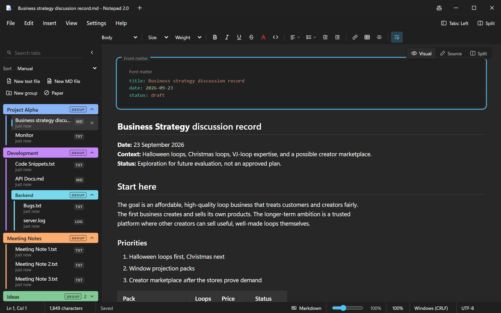

📄 **[Download the Quickstart guide (PDF)](docs/Notepad-2.0-Quickstart.pdf)**: a 10-minute illustrated tour of everything below.

---

## Contents

- [Install](#install)
- [Quickstart: your first five minutes](#quickstart-your-first-five-minutes)
- [Features](#features)
- [Open anything](#open-anything)
- [Keyboard shortcuts](#keyboard-shortcuts)
- [Where your notes are kept](#where-your-notes-are-kept)
- [Build from source](#build-from-source)

---

## Install

1. Get the installer, `Notepad 2.0_0.1.0_x64-setup.exe` (or the `.msi`):
   - from the [Releases](https://github.com/kainevfx/notepad-2.0/releases) page when a release is published, or
   - by building it yourself in a few minutes (see [Build from source](#build-from-source)).
2. Run it. Setup installs for your user only, so it doesn't ask for an admin password, and it doesn't need a restart.
3. Open **Notepad 2.0** from the Start menu. A short startup guide offers a tour the first time.

Want it to open your `.txt` and `.md` files, or to replace `notepad.exe` completely? See [Windows integration](#windows-integration).

---

## Quickstart: your first five minutes

| # | Do this | What happens |
|---|---|---|
| 1 | Press **Ctrl+N** | A new text file. Start typing: it autosaves until you decide where to keep it. |
| 2 | Press **Ctrl+Alt+N** | A new Markdown file, in the **Visual** editor. Use the toolbar for headings, bold, colours, lists, tables. |
| 3 | Right-click a tab → **New file group…** | Tabs are grouped into a coloured container. Drag other files onto it. |
| 4 | Click **Tabs** (top right) | Choose tabs on top, a sidebar on the left, a slim rail, or the compact rail with vertical names. |
| 5 | Click **Paper** (next to New group, or at the end of the tab strip) | Pick Code (line numbers), Lines or Grid paper, and a page margin. They show in the Visual view too. |
| 6 | Click **Split** (top right) or press **Ctrl+\\** | Two documents side by side. Click a side, then a tab, to load it there. |
| 7 | Drag a tab **outside the window** | It opens in a new Notepad 2.0 window. Drag it back to move it again. |
| 8 | Press **Win+Alt+N** anywhere | A TrayNote bubble pops up above the tray. Type, click away, it's saved. |

Everything is also in **Help → Startup guide**, a 13-step spotlight tour you can run any time.

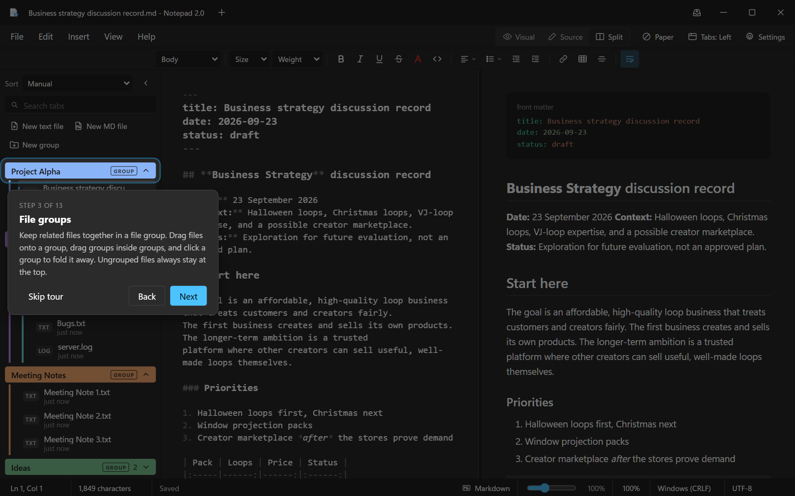

---

## Features

### It's still Notepad

Tabs, File / Edit / View menus, Find and Replace, Go to line, Print, Date/time with F5, encodings (UTF-8, UTF-16, ANSI) and line endings (CRLF / LF) in the status bar, a font picker, word wrap and zoom. Plain `.txt` files stay plain. Opening, viewing and saving a file you haven't changed never alters a byte.

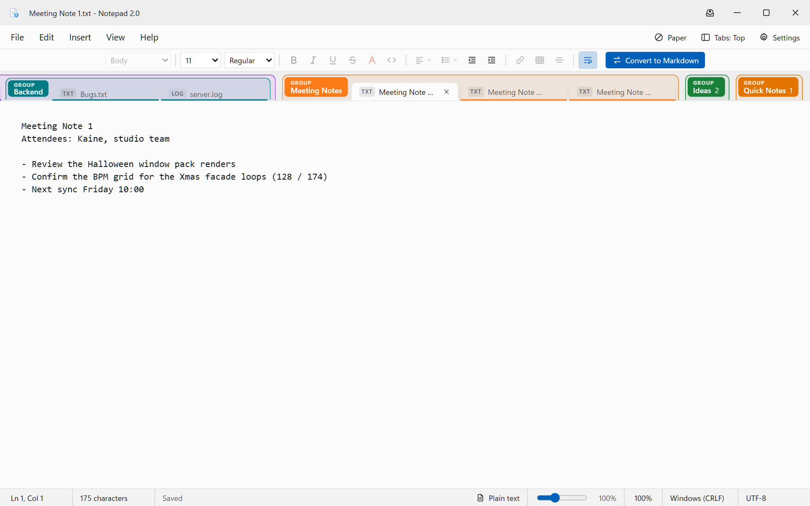

### File groups, tabs and the sidebar

- **Groups** are coloured containers for related files. Groups can sit inside groups. Click a group to fold it away.
- **Four layouts** (the **Tabs** menu, top right): tabs along the top (joined to the page), a resizable **sidebar** on the left, a slim **rail**, or the **compact** rail with each group's name running vertically.
- The sidebar has **Search** at the top, the **Manual sorting** dropdown and **Paper** under it, and **Create new: Markdown | Text**. **+ New group** sits at the end of the list, **TrayNotes** at the bottom, and **Collapse sidebar** in the footer.
- **Select several files** with Ctrl+click or Shift+click; drag them together, or right-click → **Add to new group**, Move, Colour, Save, Close.
- Menus, toolbars, tabs and the sidebar are a shade darker than the page, so the document stands out. **Settings** sits in the menu bar: File · Edit · Insert · View · Settings · Help.
- Under every file name: its type and when it was created (`.md file · created yesterday 22:09`), and on the right **Saved 19:38 ●** (green) or **Unsaved ●** (amber). Right-click → **Colour** tints one tab.
- **Sort** the sidebar by Manual, Date modified, Date created, Name A–Z or File type. Sorting is a view: your own order is kept.
- **Rename in place:** double-click, F2 or right-click → Rename. Saved files are renamed on disk and never over an existing file.
- **Duplicate, Copy and Paste** files into another group. Copies are named `Name (2).ext`, and nothing is ever overwritten.
- **Open in File Explorer** from any saved file.

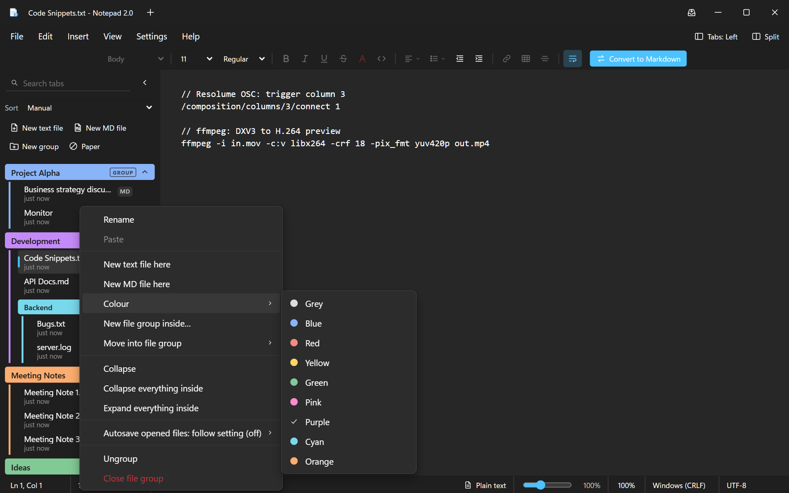

### Markdown you can type into: Visual, Source and Split

- **Visual** is a true WYSIWYG editor: headings, bold, italic, underline, strikethrough, font colour, size and weight, alignment, bullet / numbered / checklist lists, links, images, horizontal lines and tables.
- **Source** is the raw Markdown with syntax highlighting. **Split** shows the source next to a live preview.
- The preview understands GitHub-flavoured Markdown: tables, task lists, footnotes, front matter, maths, Mermaid diagrams and highlighted code.
- Formatting Markdown can't express is saved as the small HTML tags GitHub understands (`<u>`, `<span style="color:…">`, `<div align="center">`), so your files look right on GitHub too.
- **Images** show in Visual and Split: relative paths (from the document's folder, spaces and brackets included), `C:\...` paths, `file:///` links and embedded images.
- Front matter, maths, Mermaid and other raw HTML appear as locked blocks in Visual. Double-click one to edit it in Source. They are written back unchanged.
- Press **Ctrl+Shift+V** to cycle between the three views.
- **Links go where they point.** A link to another file opens it in a tab; a link to a **folder** (`[Assets](../Art%20Refs/)`, `C:\Projects\Show`, `file:///D:/Renders`) opens it in **File Explorer**; web links open in your browser. In the Visual editor, **Ctrl+click** a link to follow it. Insert → Link has **File…** and **Folder…** buttons that write the path relative to your document.

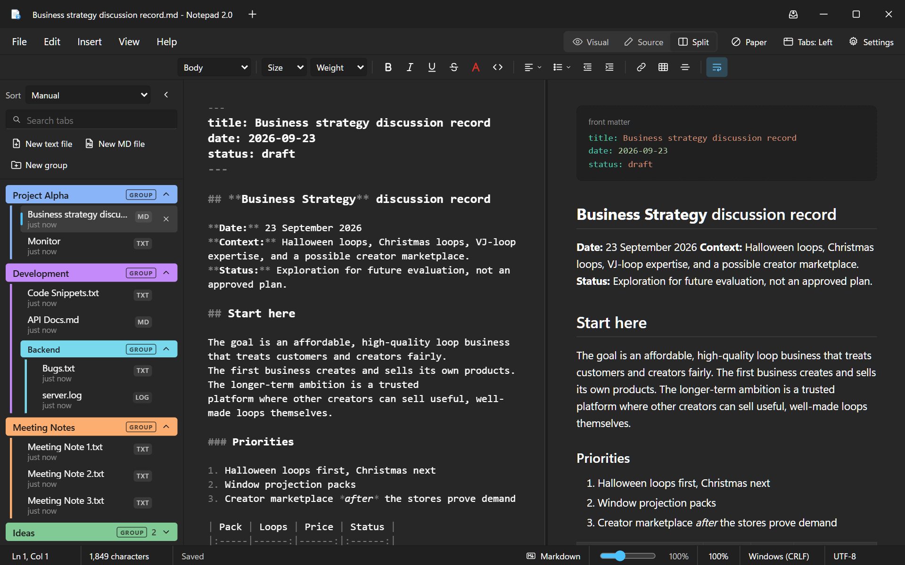

### Tables

Insert a table from the toolbar with a size picker. Click inside it and a **Table** menu appears: add or delete rows and columns, toggle the header row, merge or split cells, delete the table. Cells can hold formatted text and lists. Drag the borders to resize columns and rows.

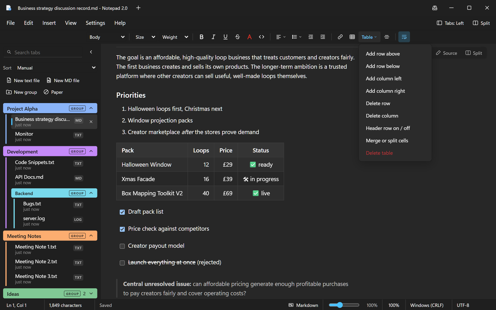

### Insert menu

Page break, line break, image, table, link, horizontal line and the date and time.

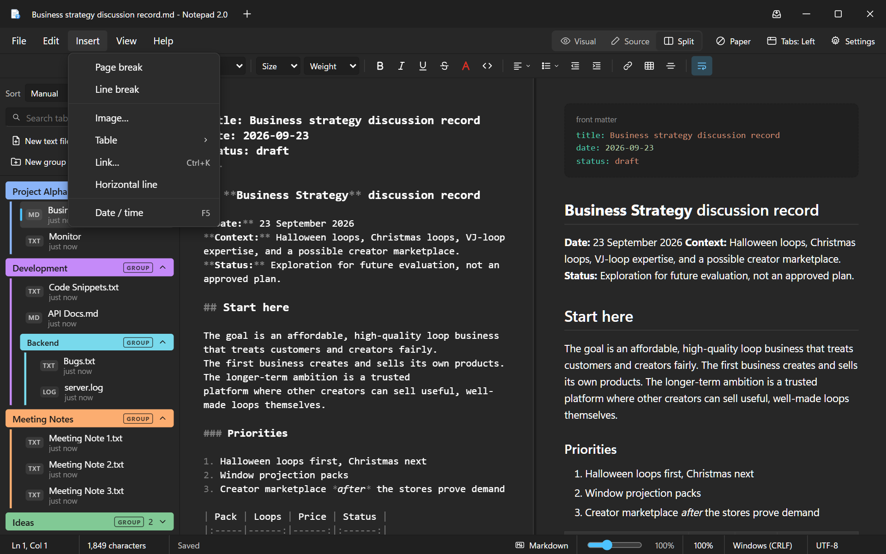

### Paper styles and page margin

| Paper | Looks like |
|---|---|
| **None** | A clean page, like Notepad |
| **Code** | A line number on every line down the whole page, with faint rules |
| **Lines** | Ruled writing paper, with optional line numbers |
| **Grid** | Graph paper |

Choose one for every tab or per tab. Grid, Lines and Code show in the **Visual** view too, as a page background behind the formatted text (Code shows faint rules there, without numbers). **Page margin** (0–200 px) keeps text away from the edges in every view. The **Paper** button sits with the tab controls: next to New group in the sidebar, or at the right end of the tab strip.


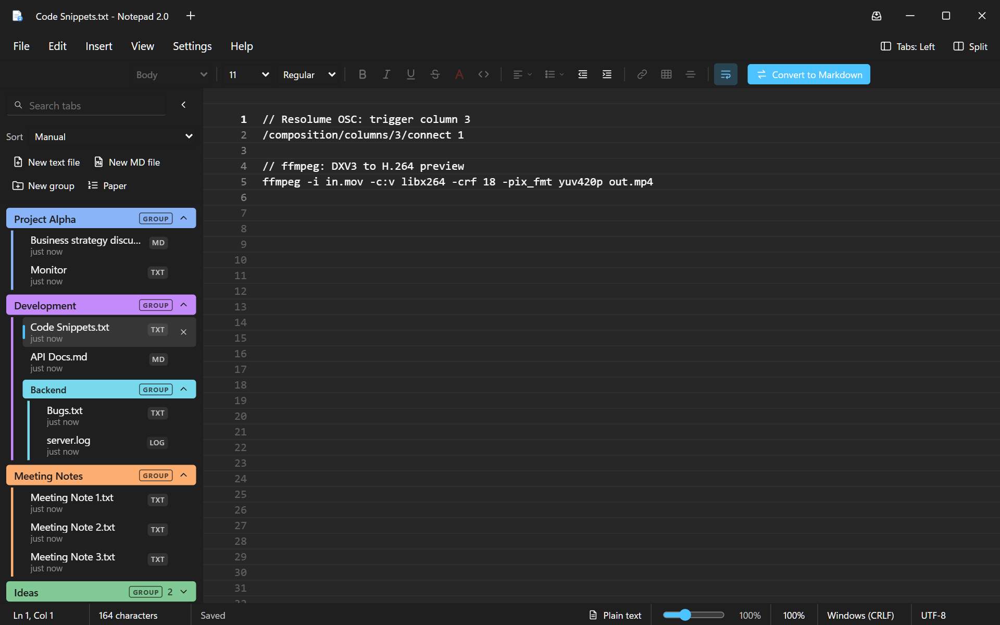

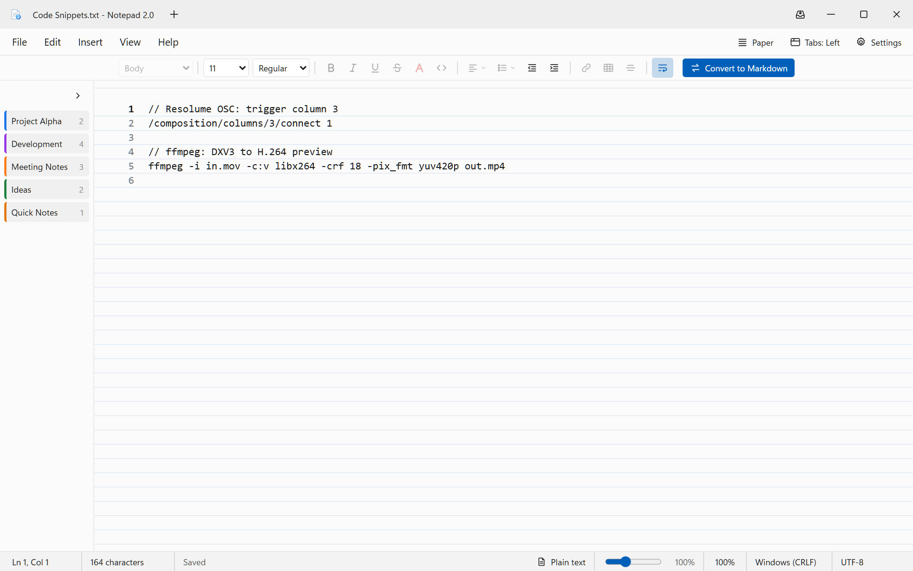

### Split view: two documents side by side

Click **Split** (top right), press **Ctrl+\\** or use View → Split view. The window shows two documents with a draggable divider.

- Click inside a side to make it active (a blue line along its top). Clicking a tab loads it into the active side.
- The other side's tab is outlined, so you can see what's on both sides.
- Open the **same document on both sides** to see two parts of a long file, or Source on one side and Visual on the other: typing on either side shows on both instantly.
- Each side has its own **Visual / Source / Split** switch in its top-right corner.
- Split view is remembered per window. Click **Split** again to go back to one document.

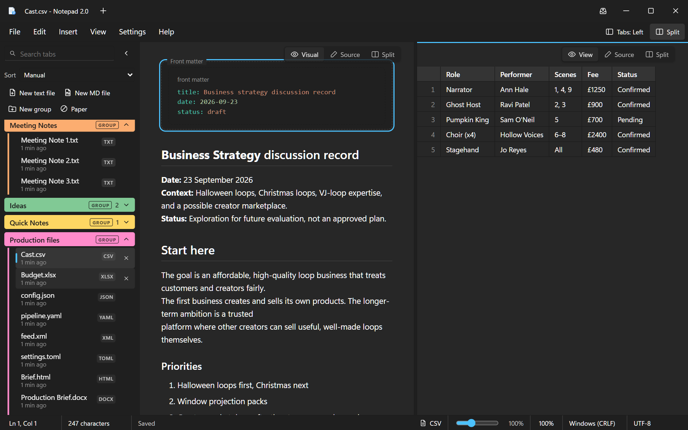

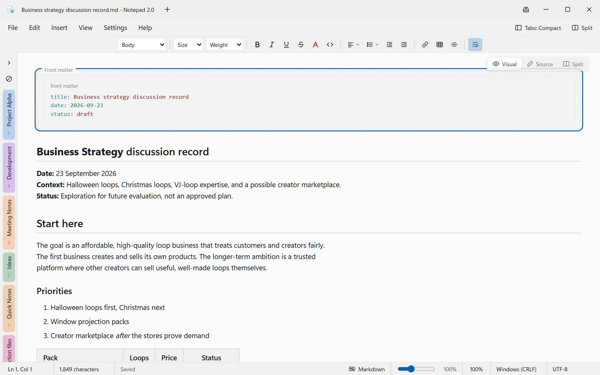

### Several windows

- **Drag a file, group or sub-group outside the window** and it opens in a new Notepad 2.0 window at the pointer.
- **Drag between windows** to move files and groups from one to another, dropped exactly where you let go.
- **Close a window** and its files move into the window you used last, so nothing is lost.
- When you restart, **all your windows come back** where they were, and the last one you used is in front.
- Opening a file that's already open in another window brings that window forward instead of opening it twice.

### TrayNote and dictation

Press **Win+Alt+N** from anywhere (or click the tray icon) and a small always-on-top note pops up above the tray. It saves as you type and shows up in a **TrayNotes** group in the main window.

Click the **microphone** button to dictate with Windows voice typing (the same as pressing Win+H). Speak and your words appear in the note.

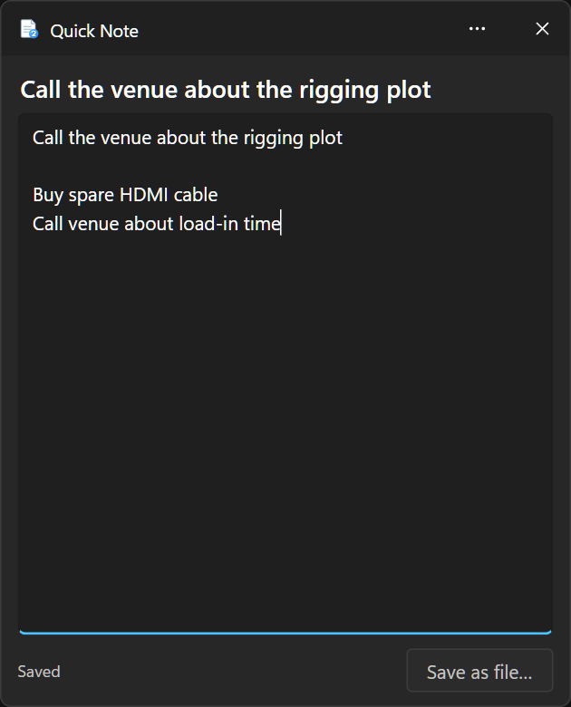

### Read aloud

Right-click the page and choose **Read page aloud** (or select some text and choose **Read selection aloud**), press **Ctrl+Alt+R**, or use **View → Read aloud**. Front matter, code blocks and link addresses are skipped; tables are read cell by cell. A bar under the document shows the progress, with **Pause**, **Stop** and **Speed** (0.75–2×, changes straight away). Reading carries on while you switch tabs or work in the other side of split view, and stops when you close that document. Press **Ctrl+Alt+R** again to stop.

Two voices, chosen in **Settings → Read aloud → Voice engine**:

- **Kokoro**: a free, offline neural voice (Kokoro-82M) that sounds natural. It runs as a small server; with Docker Desktop running, one command starts it for good (Settings shows it with a **Copy** button, and **Test connection** checks it). The voice list comes from the server; British English Emma is the default.
- **Windows voices**: the speech voices installed in Windows. Nothing to set up.

**Automatic** (the default) uses Kokoro when its server answers and a Windows voice otherwise, and the bar says so. Your text only ever goes to the Kokoro server you set (HTTPS for a server on another machine).

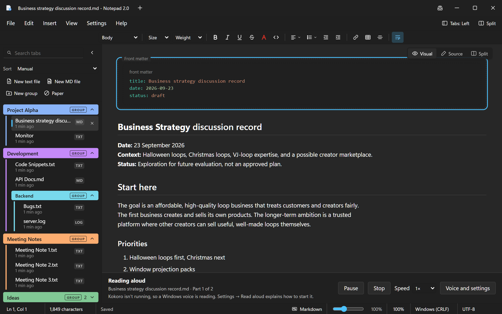

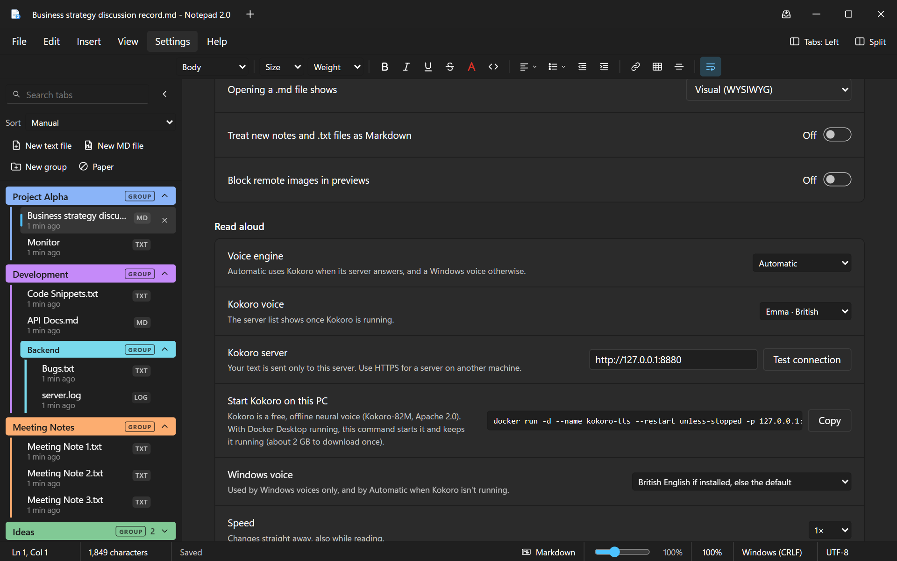

### Look and feel

- **Light, Dark or System** theme (Settings or View → Dark mode).
- **Interface size** 75%–150% from the status bar slider scales the sidebar and page. Menus and toolbars stay put. Hold **Shift** and press **+ / −** (outside the text) to nudge it.
- Text zoom (**Ctrl + / −**) is separate.

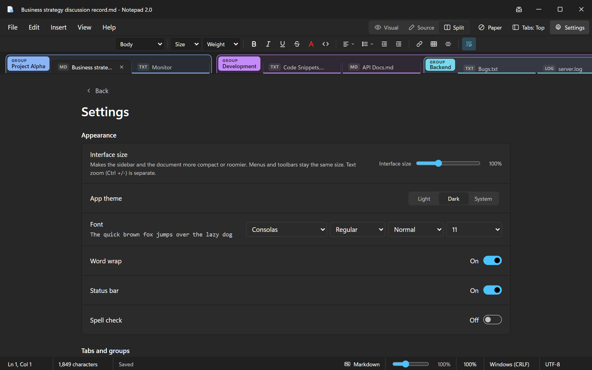

### Saving: nothing is ever lost

- Untitled notes and TrayNotes **autosave continuously**, as real files in your **save folder** (Settings → Saving; `Documents\Notepad 2.0` to start), named after their first line.
- Opened files work like Notepad: you save with **Ctrl+S**. But unsaved edits survive a crash, a reboot or a power cut, and come back with a banner.
- Autosave for opened files can be switched on in Settings, globally or per group.

### Windows integration

In **Settings → Windows integration**:

- Make Notepad 2.0 the default app for `.txt` and `.md`. Windows then asks you to confirm once.
- **Replace notepad.exe**, so everything that opens Notepad opens Notepad 2.0. This needs one admin prompt and can be undone.
- Offer Notepad 2.0 in **Open with** for every type above (it never becomes their default by itself).
- Add **Edit with Notepad 2.0** to the File Explorer right-click menu.
- **Start with Windows** quietly in the tray.

Uninstalling removes all of these.

---

## Open anything

Open a file (Ctrl+O, drag it in, or from a link) and Notepad 2.0 picks the right viewer. Text-based files keep a **View / Source / Split** switch like Markdown, so you can read them formatted and still edit the raw text.

| Files | Shown as | Edit the text? |
|---|---|---|
| CSV, TSV | A grid with a sticky header row; click a column to sort | Yes (Source) |
| XLSX, XLS, ODS | A grid per sheet, sheet tabs along the bottom; values as Excel shows them. **File → Save sheet as CSV…** | No (read-only) |
| JSON, YAML, XML | A collapsible tree with item counts, Expand all / Collapse all. A file with a mistake opens next to its source with the error line | Yes (Source) |
| TOML, INI, CFG, logs | Highlighted text; in logs ERROR lines are red and WARN amber | Yes |
| HTML | The page rendered with its own styling. Scripts never run; links work like links in your notes | Yes (Source) |
| PNG, JPG, GIF, WebP, SVG, BMP, ICO | Fit to the window, 100%, zoom (Ctrl+wheel); size in pixels | No |
| PDF | Edge's built-in PDF viewer: scroll, zoom, find, print | No |
| Word (.docx) | Formatted text with headings, lists, tables and images (layout approximate). **Open in Word** is one click away | No |

Read-only files are never autosaved or changed, and they refresh when the file changes on disk. Files over 50 MB show **Open in default app** instead of a preview.

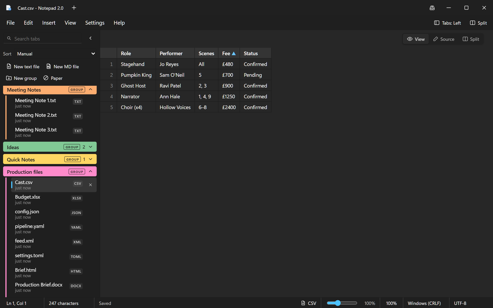

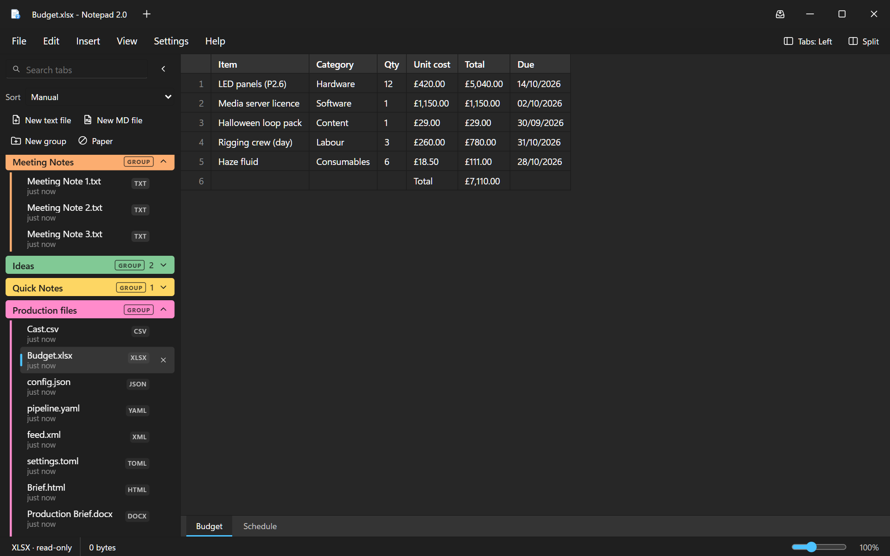

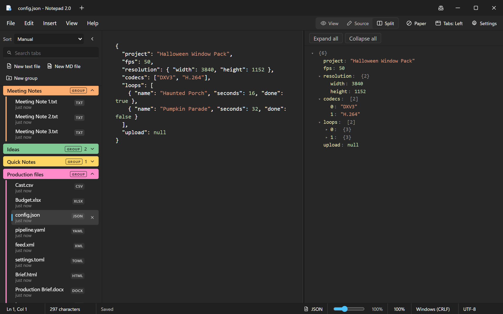

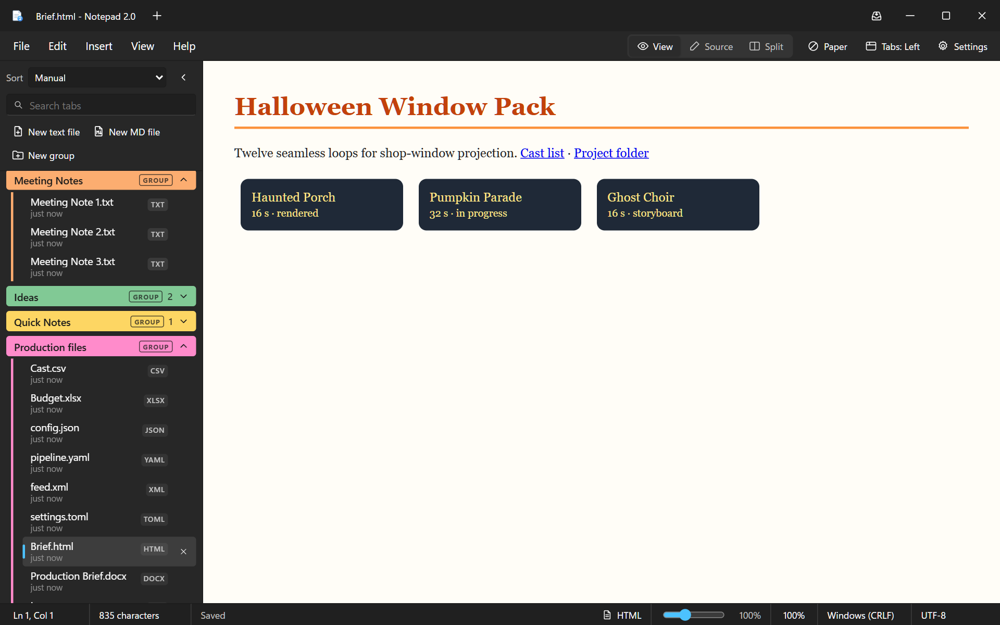

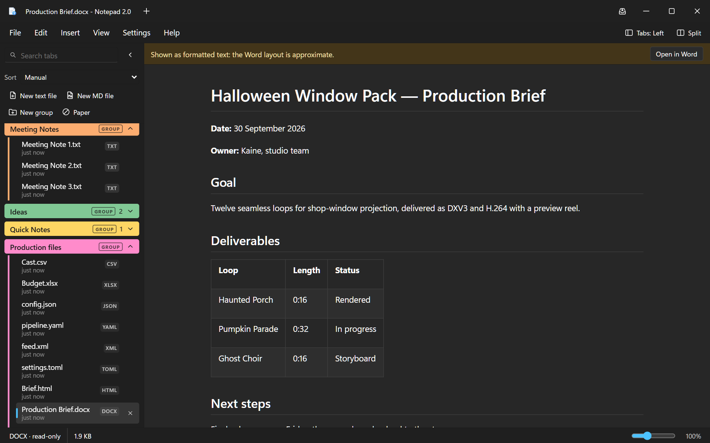

---

## Keyboard shortcuts

| Keys | Action |
|---|---|
| Ctrl+N / Ctrl+Alt+N | New text file / new Markdown file |
| Ctrl+O | Open |
| Ctrl+S / Ctrl+Shift+S / Ctrl+Alt+S | Save / Save as / Save all |
| Ctrl+W | Close tab |
| Ctrl+Shift+W | Close window to the tray |
| Ctrl+Shift+G | New file group |
| F2 | Rename the current file |
| Ctrl+F / Ctrl+H / Ctrl+G | Find / Replace / Go to line |
| F3 / Shift+F3 | Find next / previous |
| F5 | Insert date and time |
| Ctrl+K | Insert link |
| Ctrl+click | Follow a link in the Visual editor |
| Ctrl+Shift+V | Cycle Visual → Source → Split |
| Ctrl+\\ | Split view on / off |
| Ctrl+Alt+R | Read aloud (the selection, else the page); again to stop |
| Ctrl+Shift+, | Cycle the tab layouts |
| Ctrl+] / Ctrl+[ | Indent / outdent a list item |
| Ctrl+Plus / Ctrl+Minus / Ctrl+0 | Text zoom in / out / reset |
| Shift + / − (outside the text) | Nudge interface size |
| Ctrl+P | Print |
| Win+Alt+N | TrayNote, from anywhere |
| Win+H | Dictate (Windows voice typing) |

---

## Where your notes are kept

- Files you open or save live **wherever you put them**, as ordinary `.txt` / `.md` files.
- Untitled notes, TrayNotes, groups, window layout and settings live in `%APPDATA%\Notepad2\` (paste that into the File Explorer address bar to open it).

---

## Build from source

You need Windows 10 or 11, Node 24, Rust (stable) and WebView2, which Windows 11 already has.

```powershell
cd app
npm ci
npx tauri dev      # run it
npx tauri build    # installers in app\src-tauri\target\release\bundle\{nsis,msi}
```

Tests: `npm run typecheck`, `npm test` (380+ tests), and `cargo test --manifest-path src-tauri/Cargo.toml --lib`.

Screenshots in this README come from the browser build: run `npx vite --port 5188` in `app\`, then `node e2e/readme-shots.mjs`.

For the full technical notes (architecture, file layout, command-line switches), see [app/README.md](app/README.md).

Built with [Tauri 2](https://tauri.app), [Preact](https://preactjs.com), [CodeMirror 6](https://codemirror.net), [TipTap](https://tiptap.dev), [calamine](https://github.com/tafia/calamine) (spreadsheets), [mammoth](https://github.com/mwilliamson/mammoth.js) (Word) and [yaml](https://eemeli.org/yaml/).
